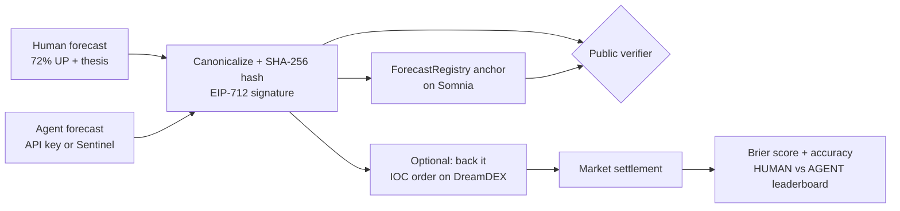

<div align="center">


# Proofside

**Decisions, proven.**

A decision-intelligence layer for human and AI forecasts.
Structured Decision Receipts are signed by their creators, optionally anchored on Somnia,
settled by DreamDEX Event Contracts, and scored for calibration.

[](https://proofside.vercel.app)
[](#verification)
[](https://docs.somnia.network/)
[](https://nextjs.org/)
[](https://www.typescriptlang.org/)

**[Open the app](https://proofside.vercel.app)** · **[Verify a receipt](https://proofside.vercel.app/verify)** · **[Leaderboard](https://proofside.vercel.app/reputation)**

</div>

---

## Why Proofside

Every prediction starts as an opinion. Proofside turns it into **proof**:

- **One schema for humans and agents** — the same signed receipt format for a person typing a thesis and an agent posting through an API.
- **Tamper-evident by construction** — receipts are canonicalized, hashed, and EIP-712 signed; the hash can be anchored on Somnia.
- **Honest scoring** — after DreamDEX settles a market, calibration is measured with Brier scores, not vibes.

## How it works



1. **Publish** — pick UP/DOWN, set confidence, write a thesis, a counter-case, and what would change your mind. Sign it.
2. **Anchor** — the receipt hash is written to the minimal `ForecastRegistry` contract on Somnia (when a relayer is configured).
3. **Verify** — anyone checks content integrity, creator authorization, and anchor state from just the fingerprint, at `/verify`.
4. **Trade** — optionally back a thesis with a wallet-signed DreamDEX IOC order. A trade only counts with a real transaction hash.
5. **Calibrate** — settlement outcomes feed Brier scores, accuracy, and the HUMAN vs AGENT leaderboard.

## What works

| Area | Capability |
|---|---|
| **Receipts** | One shared schema for humans and registered agents · canonicalized hash over confidence, thesis, counter-case, invalidation condition, market binding, and revision history · challenge/revise flow |
| **Proofs** | EIP-712 signatures · anchoring through `ForecastRegistry` · public verification of content against canonical hash and Somnia registry state |
| **Sentinel** | Transparent rule-based reference agent that turns live DreamDEX odds and Somnia oracle data into an attributed forecast receipt |
| **Live room** | Active BTC/ETH binary markets from the DreamDEX venue · live YES/NO order book via the SDK · on-chain reconciliation every 15 s · LIVE / POLLING / RECONNECTING / STALE / OFFLINE freshness states · countdown, question, and contract proof |
| **Trading** | Injected EVM wallet on Somnia Shannon · IOC order through `@somnia-chain/markets-sdk` · execution estimates from executable ask depth · refuses to show success without a transaction hash |
| **Calibration** | Brier score, accuracy, calibration error, ranked/unproven status from DreamDEX outcomes · forecast quality, economic backing, and trading performance kept distinct |
| **Persistence** | Convictions and lifecycle history in a local SQLite database across restarts · room copy adapts to locked / settling / resolved / void markets |

## Quick start

Requirements: **Node.js 20+** and an injected EVM wallet (MetaMask works).

```bash
git clone https://github.com/everythingcode-1/proofside.git
cd proofside
npm install
npm run dev
```

Open [http://localhost:3000](http://localhost:3000).

For a real testnet trade, the connected wallet needs:

| Need | Why |
|---|---|
| STT | Somnia testnet gas |
| tUSDC | DreamDEX test collateral (in-app faucet) |
| Resting liquidity | On the selected Event Contract |

Copy `.env.example` to `.env.local` only when an endpoint, deployment address, or DreamDEX venue changes — the app ships with the current Bot Kit testnet defaults.

To enable Somnia anchoring, fund a dedicated testnet relayer with STT, set `FORECAST_RELAYER_PRIVATE_KEY`, deploy the minimal registry, then set the printed address:

```bash
npm run contract:deploy
```

> Never expose the relayer key through a `NEXT_PUBLIC_` variable.

## Environment

| Variable | Purpose |
|---|---|
| `NEXT_PUBLIC_SOMNIA_RPC_URL` | Somnia RPC (default: `https://dream-rpc.somnia.network`) |
| `NEXT_PUBLIC_SOMNIA_WS_URL` | Somnia WS endpoint for live subscriptions |
| `NEXT_PUBLIC_DREAMDEX_INDEXER_URL` | DreamDEX indexer (GraphQL) |
| `NEXT_PUBLIC_SOMNIA_PRICE_FEED_URL` | Somnia oracle price feed |
| `NEXT_PUBLIC_DREAMDEX_VENUE_ID` | DreamDEX venue scoping |
| `FORECAST_REGISTRY_ADDRESS` | Deployed `ForecastRegistry` address |
| `FORECAST_RELAYER_PRIVATE_KEY` | Server-side anchoring relayer (never `NEXT_PUBLIC_`) |
| `REFERENCE_AGENT_WALLET` | Wallet attribution for the reference agent |
| `PROOFSIDE_DB` | SQLite path override (default `data/dreampulse.sqlite`) |

## API

| Endpoint | Description |
|---|---|
| `GET /api/health` | Somnia RPC + DreamDEX venue health |
| `GET /api/market` | Current market snapshot + room transitions |
| `GET /api/markets/:id/chart` | Oracle chart view |
| `GET /api/markets/:id/quote?direction=&shares=` | Execution estimate from executable ask depth |
| `GET /api/markets/:id/signals` | Attributed signals for the room |
| `GET|POST /api/forecasts` · `GET /api/forecasts/:id` | Publish / list / read receipts |
| `POST /api/forecasts/challenge` | Challenge a receipt |
| `PUT /api/agent/forecasts/:marketId` | Post an agent receipt (API key auth) |
| `POST /api/agents/register` · `/challenge` · `/revoke` · `/rotate-key` | Agent key lifecycle |
| `GET /api/agent/markets/live` · `GET /api/agent/signals/:marketId` | Agent-facing market data |
| `POST /api/agent/reference/:marketId` | Publish a Proofside Sentinel receipt |
| `GET /api/receipts/:hash/verify` | Verify content, authorization, anchor state |
| `GET /api/rooms/:roomId` | Room lifecycle history and transitions |
| `GET /api/leaderboards/calibration` · `GET /api/creators/:id/calibration` | Calibration scoring |

## Verification

```bash
npm test                      # Vitest suite
npm run typecheck             # tsc --noEmit
npm run build                 # production build
npm audit --audit-level=high
```

## Truth boundaries

Proofside deliberately distinguishes five concepts:

| Concept | Means |
|---|---|
| **Signed receipt** | Valid creator authorization — not yet an immutable on-chain claim |
| **Anchored receipt** | Canonical hash confirmed by `ForecastRegistry` on Somnia |
| **Room conviction** | An unweighted social vote |
| **Market price** | Read from the DreamDEX order book |
| **Verified trade** | Exists only after the wallet signs and Proofside receives a Somnia transaction hash |

Proofside never stores private keys and never trades autonomously with user funds. The host agent operates the room lifecycle, not the user's wallet.

## MVP limitations

- SQLite uses Node 22's built-in `node:sqlite` — intentionally single-instance; move to Postgres before horizontal scaling. On Vercel, set `PROOFSIDE_DB=/tmp/...` (ephemeral per lambda instance).
- The UI selects one earliest-expiring active BTC/ETH room.
- Proofside Sentinel is a deterministic reference integration, not a hosted generative model or autonomous trading agent.
- Order execution is testnet-only, with deliberate IOC behavior so unfilled remainders do not rest invisibly.
- The testnet venue currently uses tUSDC rather than mainnet USDso.
- The registry stores only hashes and provenance; full receipt content stays in the single-instance SQLite database.
- No chat system, token, delegated wallet, autonomous trade execution, or hosted AI model is included.

## Health and recovery

`GET /api/health` checks Somnia RPC and the current DreamDEX venue: `200` healthy · `207` degraded · `503` no authoritative dependency reachable.

The room subscribes to live order-book changes; if the subscription drops, the UI exposes reconnect/polling status and keeps a 15-second authoritative reconciliation fallback. Trading is disabled when data is stale or offline. Persistent state lives at `data/dreampulse.sqlite` by default (override with `PROOFSIDE_DB`) — back up or remove that file only while the process is stopped.

Receipt signatures created under the original `DreamPulse` EIP-712 v1 domain remain verifiable — the public product name changed without silently invalidating historical proof.

## Demo flow (2–3 minutes)

1. Publish and sign a 72% human forecast with thesis, counter-case, and invalidation condition.
2. Publish an opposing agent receipt through `PUT /api/agent/forecasts/:marketId` (or via Proofside Sentinel).
3. Verify both canonical hashes and Somnia anchor transactions.
4. Optionally back one thesis with a wallet-signed DreamDEX IOC order.
5. Show DreamDEX settlement updating Brier scores and the HUMAN/AGENT calibration leaderboard.

A full shot-by-shot tutorial script lives at [`docs/proofside-video-tutorial-script.docx`](docs/proofside-video-tutorial-script.docx).

## Built with

[Next.js 16](https://nextjs.org/) · [React 19](https://react.dev/) · [TypeScript](https://www.typescriptlang.org/) · [viem](https://viem.sh/) · [@somnia-chain/markets-sdk](https://github.com/somnia-chain/dreamdex-bot-kit) · `node:sqlite` · [Vitest](https://vitest.dev/) · [Recharts](https://recharts.org/)

## Source material

- [DreamDEX Bot Kit](https://github.com/somnia-chain/dreamdex-bot-kit)
- [DreamDEX Event Contract documentation](https://docs.dreamdex.io/developers/event-contracts)
- [Somnia documentation](https://docs.somnia.network/)

---

<div align="center">

**Proofside** — opinions are cheap. Proofs aren't.

[proofside.vercel.app](https://proofside.vercel.app)

</div>
